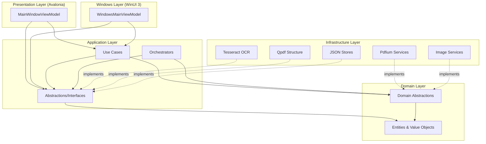

# Velune — UML Class Diagram

## Full Architecture Class Diagram (Mermaid)

```mermaid
classDiagram
    direction TB

    %% ═══════════════════════════════════════════
    %% DOMAIN LAYER
    %% ═══════════════════════════════════════════

    namespace Domain {
        class IDocumentOpener {
            <<interface>>
            +OpenAsync(filePath, ct) Task~IDocumentSession~
        }

        class IDocumentSession {
            <<interface>>
            +Id DocumentId
            +Metadata DocumentMetadata
            +Viewport ViewportState
            +WithViewport(viewport) IDocumentSession
        }

        class IImageDocumentSession {
            <<interface>>
            +ImageMetadata ImageMetadata
        }

        class IRenderService {
            <<interface>>
            +RenderPageAsync(session, pageIndex, zoomFactor, rotation, ct) Task~RenderedPage~
        }

        class DocumentSession {
            <<record>>
            +Id DocumentId
            +Metadata DocumentMetadata
            +Viewport ViewportState
            +WithViewport(viewport) IDocumentSession
        }

        class ViewportState {
            <<sealed record>>
            +CurrentPage PageIndex
            +ZoomFactor double
            +ZoomMode ZoomMode
            +Rotation Rotation
            +Default$ ViewportState
            +WithPage(page) ViewportState
            +WithZoom(factor, mode) ViewportState
            +WithRotation(rotation) ViewportState
        }

        class RenderedPage {
            <<sealed>>
            +PageIndex PageIndex
            +PixelData ReadOnlyMemory~byte~
            +Width int
            +Height int
            +ByteCount int
            +CopyPixelDataTo(destination)
        }

        class DocumentMetadata {
            +PageCount int
            +PixelWidth int
            +PixelHeight int
            +DocumentType DocumentType
            +FormatLabel string
            +DocumentTitle string
        }

        class DocumentId {
            <<value object>>
            +Value Guid
            +New()$ DocumentId
        }

        class PageIndex {
            <<value object>>
            +Value int
        }

        class Rotation {
            <<enum>>
            None
            Clockwise90
            Clockwise180
            Clockwise270
        }

        class ZoomMode {
            <<enum>>
            Manual
            FitWidth
            FitPage
        }

        class DocumentType {
            <<enum>>
            Pdf
            Image
            Unsupported
        }

        class DocumentAnnotation {
            +Id Guid
            +Kind DocumentAnnotationKind
            +Bounds NormalizedPoint[]
            +Points NormalizedPoint[]
            +Appearance AnnotationAppearance
            +Text string
            +AssetId string
            +DeepCopy() DocumentAnnotation
        }
    }

    IDocumentSession <|.. DocumentSession
    IDocumentSession <|-- IImageDocumentSession
    DocumentSession --> DocumentId
    DocumentSession --> DocumentMetadata
    DocumentSession --> ViewportState
    ViewportState --> PageIndex
    ViewportState --> ZoomMode
    ViewportState --> Rotation
    DocumentMetadata --> DocumentType
    RenderedPage --> PageIndex

    %% ═══════════════════════════════════════════
    %% APPLICATION LAYER
    %% ═══════════════════════════════════════════

    namespace Application {
        class IDocumentSessionStore {
            <<interface>>
            +Sessions IReadOnlyList~IDocumentSession~
            +ActiveSessionId DocumentId?
            +Current IDocumentSession?
            +SetCurrent(session)
            +Add(session, makeActive)
            +TryActivate(id) bool
            +Remove(id) bool
            +UpdateViewport(viewport)
            +Clear()
        }

        class IRenderOrchestrator {
            <<interface>>
            +Submit(request) RenderJobHandle
            +Cancel(jobId) bool
            +CancelDocumentJobsAsync(docId, ct) Task
        }

        class IRenderMemoryCache {
            <<interface>>
            +TryGet(docId, request, out page) bool
            +Store(docId, request, page)
        }

        class IPdfDocumentStructureService {
            <<interface>>
            +IsAvailable() bool
            +RotatePagesAsync(...) Task~Result~string~~
            +DeletePagesAsync(...) Task~Result~string~~
            +ExtractPagesAsync(...) Task~Result~string~~
            +MergeDocumentsAsync(...) Task~Result~string~~
            +ReorderPagesAsync(...) Task~Result~string~~
        }

        class IOcrEngine {
            <<interface>>
            +GetInfoAsync(ct) Task~Result~OcrEngineInfo~~
            +RecognizePageAsync(request, langs, ct) Task~Result~OcrPageContent~~
        }

        class IDocumentTextService {
            <<interface>>
            +LoadAsync(session, langs, ct) Task~Result~DocumentTextLoadResult~~
            +RunOcrAsync(session, langs, ct) Task~Result~DocumentTextIndex~~
        }

        class IDocumentTextAnalysisOrchestrator {
            <<interface>>
            +Submit(request) DocumentTextJobHandle
            +Cancel(jobId) bool
        }

        class IPdfMarkupService {
            <<interface>>
            +ApplyAnnotationsAsync(request, ct) Task~Result~string~~
        }

        class IImageMarkupService {
            <<interface>>
            +ApplyAnnotationsAsync(request, ct) Task~Result~string~~
        }

        class ISignatureAssetStore {
            <<interface>>
            +GetAllAsync(ct) Task~IReadOnlyList~SignatureAsset~~
            +ImportAsync(sourcePath, ct) Task~SignatureAsset~
            +DeleteAsync(assetId, ct) Task
            +GetAssetPath(assetId) string?
        }

        class IPageViewportStore {
            <<interface>>
            +ActivePageIndex int
            +Initialize(pageCount)
            +SetActivePage(index)
            +GetRotation(pageIndex) Rotation
            +SetRotation(pageIndex, rotation)
        }

        class IUserPreferencesService {
            <<interface>>
            +Current UserPreferences
            +PreferencesChanged event
            +LoadAsync() Task
            +SaveAsync(prefs) Task
        }

        class IRecentFilesService {
            <<interface>>
            +GetRecentFilesAsync() Task~IReadOnlyList~RecentFileItem~~
            +AddAsync(filePath) Task
            +RemoveAsync(filePath) Task
        }

        class IThumbnailDiskCache {
            <<interface>>
            +TryGetAsync(docId, request) Task~RenderedPage?~
            +StoreAsync(docId, request, page) Task
        }

        class OpenDocumentUseCase {
            <<sealed>>
            -_documentOpener IDocumentOpener
            -_sessionStore IDocumentSessionStore
            -_performanceMetrics IPerformanceMetrics
            -_renderOrchestrator IRenderOrchestrator
            +ExecuteAsync(request, ct) Task~Result~IDocumentSession~~
        }

        class RenderVisiblePageUseCase {
            <<sealed>>
            -_sessionStore IDocumentSessionStore
            -_renderService IRenderService
            +ExecuteAsync(request, ct) Task~Result~RenderedPage~~
        }

        class ChangePageUseCase {
            <<sealed>>
            -_sessionStore IDocumentSessionStore
            +Execute(request) Result~ViewportState~
        }

        class ChangeZoomUseCase {
            <<sealed>>
            -_sessionStore IDocumentSessionStore
            +Execute(request) Result~ViewportState~
        }

        class CloseDocumentUseCase {
            <<sealed>>
            -_sessionStore IDocumentSessionStore
            -_renderOrchestrator IRenderOrchestrator
            -_textAnalysisOrchestrator IDocumentTextAnalysisOrchestrator
            +ExecuteAsync(request, ct) Task~Result~
        }

        class MergePdfDocumentsUseCase {
            <<sealed>>
            -_structureService IPdfDocumentStructureService
            +ExecuteAsync(request, ct) Task~Result~string~~
        }

        class RotatePdfPagesUseCase {
            <<sealed>>
            -_structureService IPdfDocumentStructureService
            +ExecuteAsync(request, ct) Task~Result~string~~
        }

        class DeletePdfPagesUseCase {
            <<sealed>>
            -_structureService IPdfDocumentStructureService
            +ExecuteAsync(request, ct) Task~Result~string~~
        }

        class RenderOrchestrator {
            <<sealed>>
            -_performanceMetrics IPerformanceMetrics
            -_renderMemoryCache IRenderMemoryCache
            -_thumbnailDiskCache IThumbnailDiskCache
            -_sessionStore IDocumentSessionStore
            -_renderService IRenderService
            -_gate object
            -_viewerQueue Queue~Guid~
            -_thumbnailQueue Queue~Guid~
            -_jobs Dictionary~Guid, QueuedRenderJob~
            -_worker Task
            +Submit(request) RenderJobHandle
            +Cancel(jobId) bool
            +CancelDocumentJobsAsync(docId, ct) Task
            +Dispose()
        }

        class RenderMemoryCache {
            <<sealed>>
            -_maxEntries int
            -_maxTotalBytes long
            +TryGet(docId, request, out page) bool
            +Store(docId, request, page)
        }

        class Result {
            +IsSuccess bool
            +IsFailure bool
            +Error AppError?
        }

        class ResultT["Result&lt;T&gt;"] {
            <<sealed>>
            +Value T?
        }

        class AppError {
            +Type ErrorType
            +Message string
            +NotFound(msg)$ AppError
            +Validation(msg)$ AppError
            +Conflict(msg)$ AppError
            +Failure(msg)$ AppError
            +External(msg)$ AppError
        }

        class InMemoryDocumentSessionStore {
            <<sealed>>
            -_sessions List~IDocumentSession~
        }

        class InMemoryPageViewportStore {
            <<sealed>>
            -_rotations Dictionary~int, Rotation~
        }
    }

    Result <|-- ResultT
    IRenderOrchestrator <|.. RenderOrchestrator
    IRenderMemoryCache <|.. RenderMemoryCache
    IDocumentSessionStore <|.. InMemoryDocumentSessionStore
    IPageViewportStore <|.. InMemoryPageViewportStore

    OpenDocumentUseCase --> IDocumentOpener
    OpenDocumentUseCase --> IDocumentSessionStore
    OpenDocumentUseCase --> IRenderOrchestrator
    RenderVisiblePageUseCase --> IDocumentSessionStore
    RenderVisiblePageUseCase --> IRenderService
    ChangePageUseCase --> IDocumentSessionStore
    ChangeZoomUseCase --> IDocumentSessionStore
    CloseDocumentUseCase --> IDocumentSessionStore
    CloseDocumentUseCase --> IRenderOrchestrator
    CloseDocumentUseCase --> IDocumentTextAnalysisOrchestrator
    MergePdfDocumentsUseCase --> IPdfDocumentStructureService
    RotatePdfPagesUseCase --> IPdfDocumentStructureService
    DeletePdfPagesUseCase --> IPdfDocumentStructureService

    RenderOrchestrator --> IRenderMemoryCache
    RenderOrchestrator --> IThumbnailDiskCache
    RenderOrchestrator --> IDocumentSessionStore
    RenderOrchestrator --> IRenderService

    %% ═══════════════════════════════════════════
    %% INFRASTRUCTURE LAYER
    %% ═══════════════════════════════════════════

    namespace Infrastructure {
        class PdfiumInitializer {
            <<sealed>>
            +EnsureLoaded()
            +Dispose()
        }

        class PdfiumExecutionGate {
            <<sealed>>
            -_semaphore SemaphoreSlim
            +AcquireAsync(ct) Task~IDisposable~
            +Dispose()
        }

        class PdfiumDocumentOpener {
            <<sealed>>
            -_initializer PdfiumInitializer
            -_executionGate PdfiumExecutionGate
            +Open(filePath) IDocumentSession
        }

        class PdfiumDocumentSession {
            <<sealed record>>
            -resource PdfiumDocumentResource
            +ReleaseResources()
        }

        class PdfiumDocumentResource {
            <<sealed>>
            -_handle nint
            -_gate PdfiumExecutionGate
            +Handle nint
            +Dispose()
        }

        class PdfiumRenderService {
            <<sealed>>
            -_initializer PdfiumInitializer
            -_executionGate PdfiumExecutionGate
            +RenderPageAsync(session, pageIndex, zoom, rotation, ct) Task~RenderedPage~
        }

        class DispatchingDocumentOpener {
            <<sealed>>
            -_pdfiumDocumentOpener PdfiumDocumentOpener
            -_imageDocumentOpener SkiaImageDocumentOpener
            +OpenAsync(filePath, ct) Task~IDocumentSession~
        }

        class DispatchingRenderService {
            <<sealed>>
            -_pdfiumRenderService PdfiumRenderService
            -_imageRenderService ImageRenderService
            +RenderPageAsync(session, pageIndex, zoom, rotation, ct) Task~RenderedPage~
        }

        class SkiaImageDocumentOpener {
            <<sealed>>
            +Open(filePath) IDocumentSession
        }

        class ImageRenderService {
            <<sealed>>
            +RenderPageAsync(session, pageIndex, zoom, rotation, ct) Task~RenderedPage~
        }

        class ImageDocumentSession {
            <<sealed record>>
            +ImageMetadata ImageMetadata
        }

        class QpdfDocumentStructureService {
            <<sealed>>
            -_qpdfTool BundledTool
            -_pdfiumInitializer PdfiumInitializer
            +IsAvailable() bool
            +RotatePagesAsync(...) Task~Result~string~~
            +DeletePagesAsync(...) Task~Result~string~~
            +ExtractPagesAsync(...) Task~Result~string~~
            +MergeDocumentsAsync(...) Task~Result~string~~
            +ReorderPagesAsync(...) Task~Result~string~~
        }

        class TesseractOcrEngine {
            <<sealed>>
            -_tesseractTool BundledTool
            +GetInfoAsync(ct) Task~Result~OcrEngineInfo~~
            +RecognizePageAsync(request, langs, ct) Task~Result~OcrPageContent~~
        }

        class SkiaPdfMarkupService {
            <<sealed>>
            -_pdfiumInitializer PdfiumInitializer
            -_signatureAssetStore ISignatureAssetStore
            +ApplyAnnotationsAsync(request, ct) Task~Result~string~~
        }

        class SkiaImageMarkupService {
            <<sealed>>
            -_signatureAssetStore ISignatureAssetStore
            +ApplyAnnotationsAsync(request, ct) Task~Result~string~~
        }

        class JsonUserPreferencesService {
            <<sealed>>
        }

        class JsonRecentFilesService {
            <<sealed>>
        }

        class JsonSignatureAssetStore {
            <<sealed>>
        }

        class DocumentTextService {
            <<sealed>>
        }

        class TesseractLanguageMapper {
            <<static>>
            +Map(locale) string[]
        }
    }

    IDocumentOpener <|.. DispatchingDocumentOpener
    IRenderService <|.. PdfiumRenderService
    IRenderService <|.. DispatchingRenderService
    IRenderService <|.. ImageRenderService
    IDocumentSession <|.. PdfiumDocumentSession
    IDocumentSession <|.. ImageDocumentSession
    IImageDocumentSession <|.. ImageDocumentSession
    IPdfDocumentStructureService <|.. QpdfDocumentStructureService
    IOcrEngine <|.. TesseractOcrEngine
    IPdfMarkupService <|.. SkiaPdfMarkupService
    IImageMarkupService <|.. SkiaImageMarkupService
    IUserPreferencesService <|.. JsonUserPreferencesService
    IRecentFilesService <|.. JsonRecentFilesService
    ISignatureAssetStore <|.. JsonSignatureAssetStore
    IDocumentTextService <|.. DocumentTextService

    DispatchingDocumentOpener --> PdfiumDocumentOpener
    DispatchingDocumentOpener --> SkiaImageDocumentOpener
    DispatchingRenderService --> PdfiumRenderService
    DispatchingRenderService --> ImageRenderService
    PdfiumDocumentOpener --> PdfiumInitializer
    PdfiumDocumentOpener --> PdfiumExecutionGate
    PdfiumRenderService --> PdfiumInitializer
    PdfiumRenderService --> PdfiumExecutionGate
    PdfiumDocumentSession --> PdfiumDocumentResource
    PdfiumDocumentResource --> PdfiumExecutionGate
    QpdfDocumentStructureService --> PdfiumInitializer
    SkiaPdfMarkupService --> PdfiumInitializer
    SkiaPdfMarkupService --> ISignatureAssetStore

    %% ═══════════════════════════════════════════
    %% PRESENTATION LAYER (Avalonia)
    %% ═══════════════════════════════════════════

    namespace Presentation {
        class IFilePickerService {
            <<interface>>
            +PickOpenFileAsync(ct) Task~string?~
            +PickOpenMergeSourceFilesAsync(suggested, ct) Task~IReadOnlyList~string~~
            +PickSavePdfFileAsync(suggested, title, ct) Task~string?~
        }

        class ILocalizationService {
            <<interface>>
            +CurrentLocale string
            +LanguageChanged event
            +Get(key) string
            +SetLocale(locale)
        }

        class MainWindowViewModel {
            <<partial>>
            -_filePickerService IFilePickerService
            -_openDocumentUseCase OpenDocumentUseCase
            -_closeDocumentUseCase CloseDocumentUseCase
            -_changePageUseCase ChangePageUseCase
            -_changeZoomUseCase ChangeZoomUseCase
            -_renderOrchestrator IRenderOrchestrator
            -_documentSessionStore IDocumentSessionStore
            -_recentFilesService IRecentFilesService
            -_userPreferencesService IUserPreferencesService
            -... (29 dependencies total)
            +DocumentTabs ObservableCollection~DocumentTabViewModel~
            +ActiveDocumentTab DocumentTabViewModel?
            +HandleHomeFilesDroppedAsync(paths) Task
            +UpdateDocumentViewportAsync() Task
            +Dispose()
        }

        class DocumentTabViewModel {
            <<sealed partial>>
            +SessionId DocumentId
            +FilePath string
            +Title string
            +IsActive bool
            +IsDirty bool
        }

        class PageThumbnailItemViewModel {
            <<sealed>>
            +SourcePageNumber int
            +Dispose()
        }

        class AvaloniaFilePickerService {
            <<sealed>>
        }
    }

    IFilePickerService <|.. AvaloniaFilePickerService
    MainWindowViewModel --> IFilePickerService
    MainWindowViewModel --> OpenDocumentUseCase
    MainWindowViewModel --> CloseDocumentUseCase
    MainWindowViewModel --> ChangePageUseCase
    MainWindowViewModel --> ChangeZoomUseCase
    MainWindowViewModel --> IRenderOrchestrator
    MainWindowViewModel --> IDocumentSessionStore
    MainWindowViewModel --> IRecentFilesService
    MainWindowViewModel --> IUserPreferencesService
    MainWindowViewModel --> ILocalizationService
    MainWindowViewModel *-- DocumentTabViewModel
    MainWindowViewModel *-- PageThumbnailItemViewModel

    %% ═══════════════════════════════════════════
    %% WINDOWS LAYER (WinUI 3)
    %% ═══════════════════════════════════════════

    namespace Windows {
        class IWindowsFileDialogService {
            <<interface>>
            +PickOpenFileAsync() Task~string?~
            +PickMergeSourceFilesAsync() Task~IReadOnlyList~string~~
            +PickSavePdfFileAsync(suggested) Task~string?~
        }

        class IWindowsPrintCoordinator {
            <<interface>>
            +PrintAsync(request) Task~bool~
        }

        class IWindowsTextCatalog {
            <<interface>>
            +Get(key) string
            +LanguageChanged event
        }

        class WindowsMainViewModel {
            <<sealed partial>>
            -_openDocumentUseCase OpenDocumentUseCase
            -_closeDocumentUseCase CloseDocumentUseCase
            -_documentSessionStore IDocumentSessionStore
            -_renderOrchestrator IRenderOrchestrator
            -_fileDialogService IWindowsFileDialogService
            -_printCoordinator IWindowsPrintCoordinator
            -_textCatalog IWindowsTextCatalog
            -_signatureAssetStore ISignatureAssetStore
            -... (21 dependencies total)
            +Tabs ObservableCollection~WindowsDocumentTabViewModel~
            +ActiveTab WindowsDocumentTabViewModel?
            +OpenPathAsync(path) Task
            +Dispose()
        }

        class WindowsDocumentTabViewModel {
            <<sealed partial>>
            +SessionId DocumentId
            +Title string
            +TotalPages int
            +DocumentType DocumentType
            +SetCurrentPagePixels(data, w, h)
            +AddAnnotation(annotation)
            +RefreshAnnotationOverlays()
            +ApplySearchResults(hits)
        }

        class WindowsPageThumbnailViewModel {
            <<sealed>>
            +PageNumber int
            +IsSelected bool
            +SetPixels(data, w, h)
        }

        class PageOrganizerViewModel {
            <<sealed>>
            +Pages ObservableCollection~PageOrganizerItemViewModel~
            +Initialize(session) Task
            +MovePages(indices, target)
            +GetFinalPageOrder() int[]
            +GetDeletedOriginalPages() int[]
        }

        class WindowsFileDialogService {
            <<sealed>>
        }

        class WindowsPrintCoordinator {
            <<sealed>>
        }
    }

    IWindowsFileDialogService <|.. WindowsFileDialogService
    IWindowsPrintCoordinator <|.. WindowsPrintCoordinator
    WindowsMainViewModel --> IWindowsFileDialogService
    WindowsMainViewModel --> IWindowsPrintCoordinator
    WindowsMainViewModel --> IWindowsTextCatalog
    WindowsMainViewModel --> OpenDocumentUseCase
    WindowsMainViewModel --> CloseDocumentUseCase
    WindowsMainViewModel --> IDocumentSessionStore
    WindowsMainViewModel --> IRenderOrchestrator
    WindowsMainViewModel --> ISignatureAssetStore
    WindowsMainViewModel *-- WindowsDocumentTabViewModel
    WindowsMainViewModel *-- WindowsPageThumbnailViewModel
    WindowsDocumentTabViewModel --> DocumentId
```

---

## Layer Dependency Summary



---

## Design Patterns Used

| Pattern | Where | Purpose |
|---------|-------|---------|
| Strategy | `DispatchingDocumentOpener`, `DispatchingRenderService` | Route to format-specific implementation (PDF vs Image) |
| Result | `Result<T>`, `AppError`, `ErrorType` | Railway-oriented error handling without exceptions |
| Orchestrator/Queue | `RenderOrchestrator`, `DocumentTextAnalysisOrchestrator` | Background job scheduling with priority and cancellation |
| Value Object | `DocumentId`, `PageIndex`, `ViewportState`, `Rotation` | Immutable domain primitives |
| Repository | `IDocumentSessionStore` | In-memory session lifecycle management |
| Factory | `ResultFactory` | Consistent Result creation |
| MVVM | All ViewModels + `ObservableObject` | UI data binding with separation |
| Dependency Injection | All layers | Loose coupling via constructor injection |
| Facade | `MainWindowViewModel` / `WindowsMainViewModel` | Unified surface over 17 use cases |
| Adapter | `TesseractLanguageMapper`, `RenderErrorMapper` | Convert between domain models |
