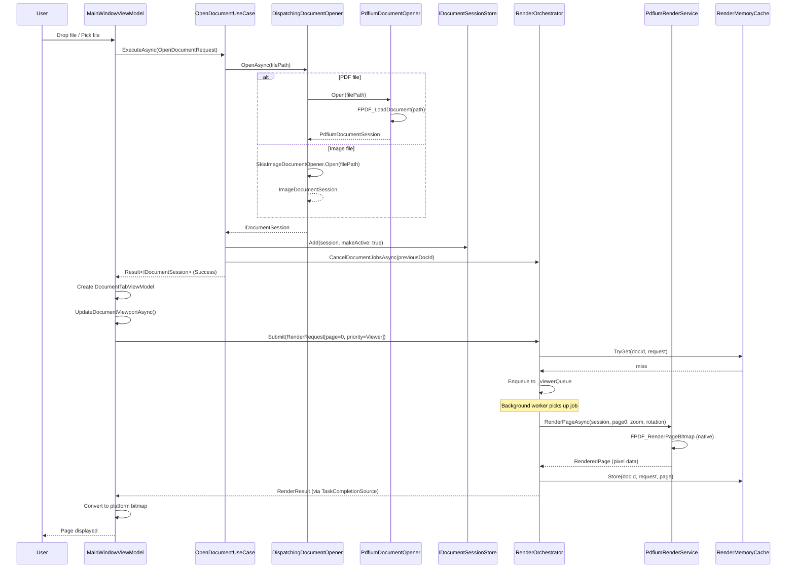
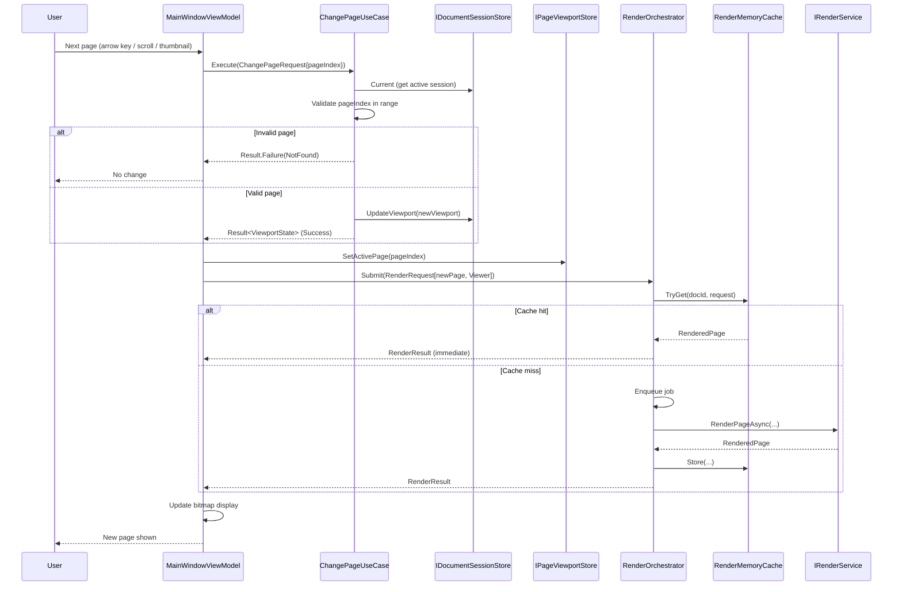
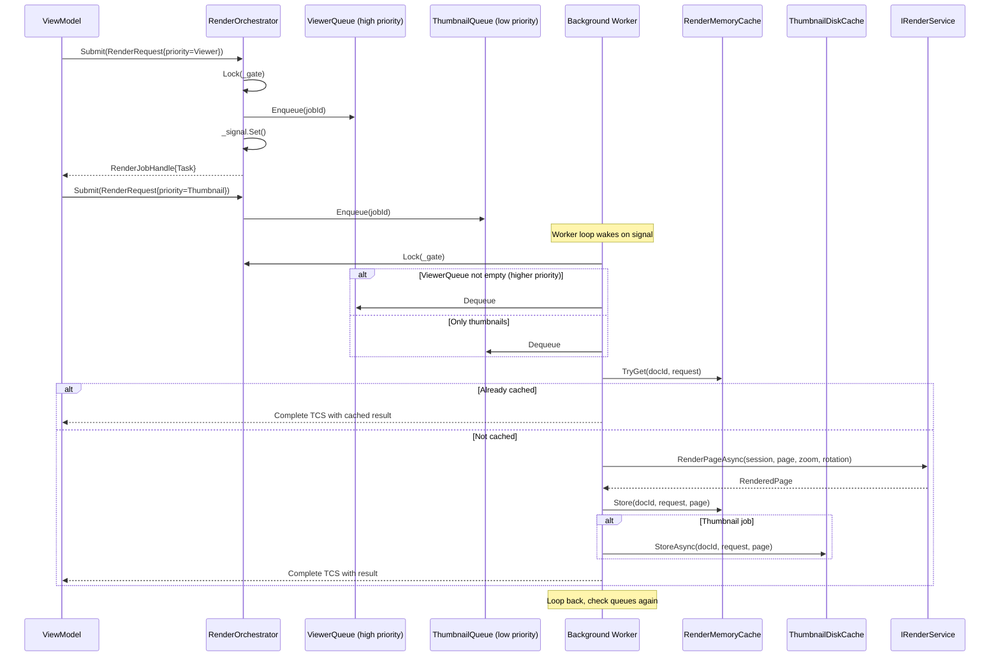
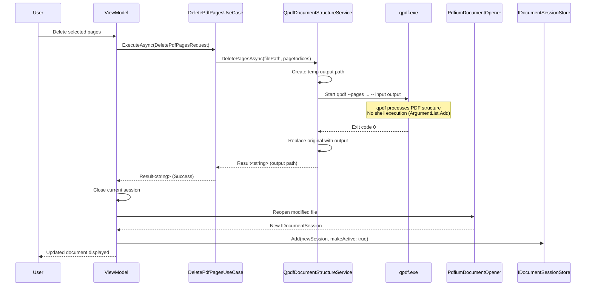
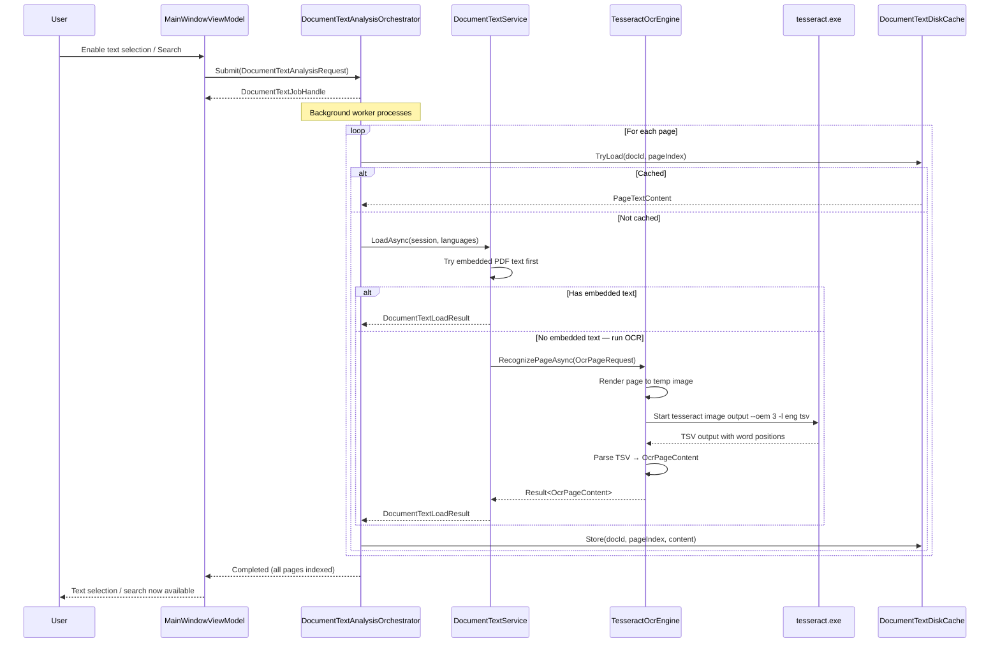
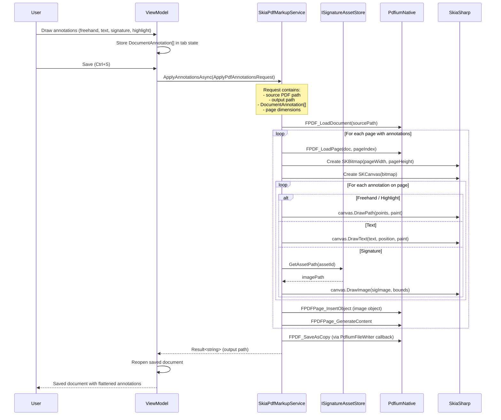
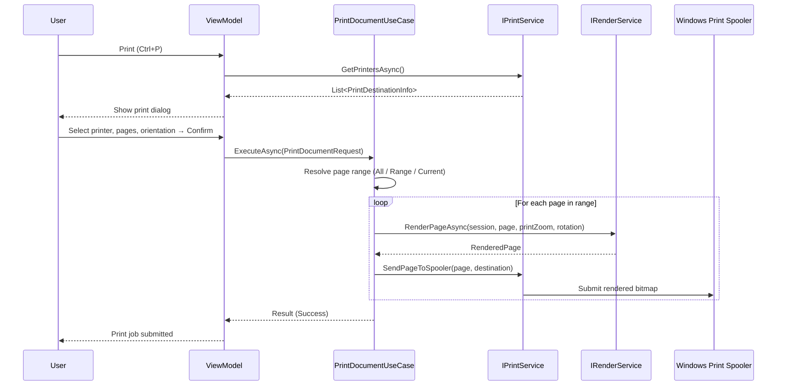
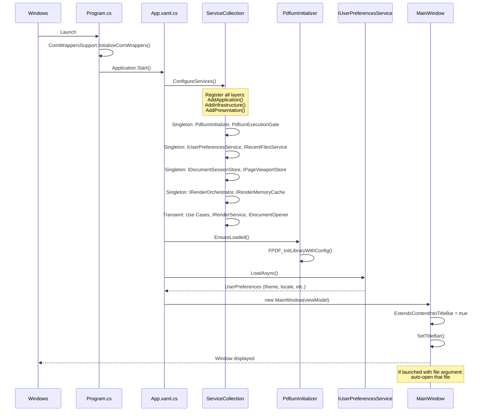
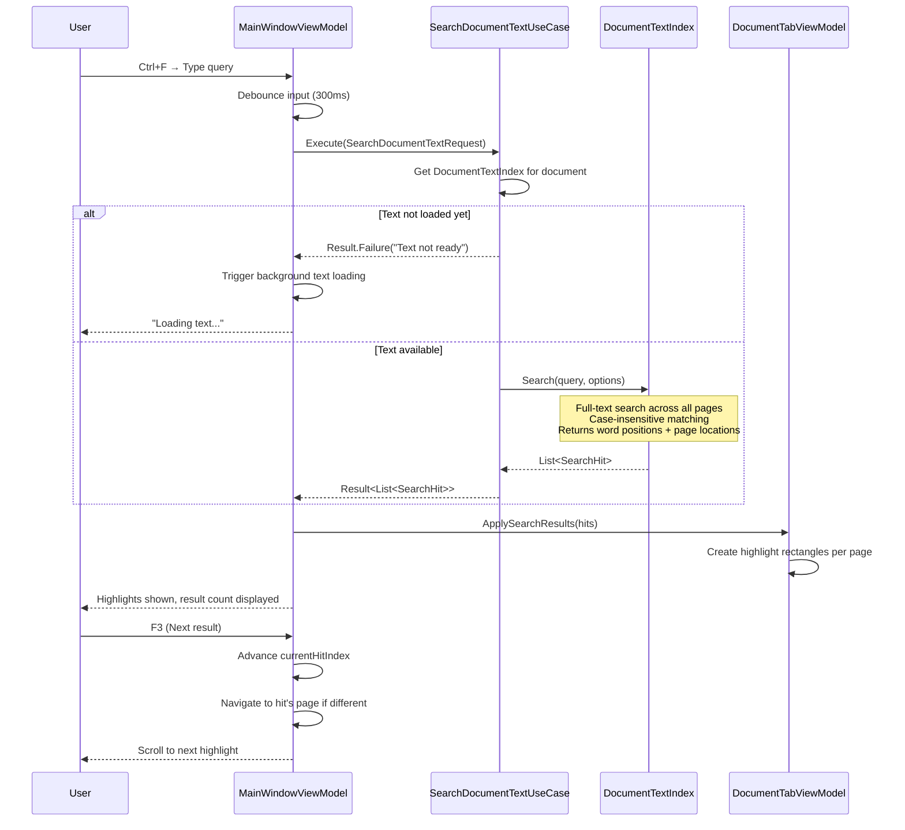
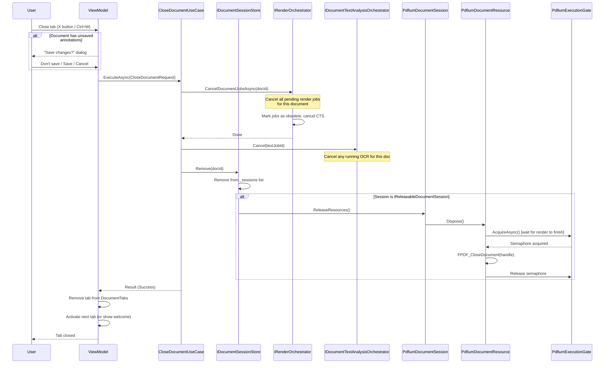

# Velune — Sequence Diagrams

## 1. Open Document Flow

The primary user flow: user opens a file, system loads it, renders first page.

---

## 2. Page Navigation Flow

User navigates to a different page via arrow keys, scroll, or thumbnail click.

---

## 3. Render Orchestrator Internal Flow

Shows priority queue processing with viewer vs thumbnail priority.

---

## 4. PDF Page Structure Operations (Delete/Reorder/Rotate/Extract/Merge)

Uses qpdf external process for structural PDF modifications.

---

## 5. OCR Text Extraction Flow

Background text analysis via Tesseract OCR engine.

---

## 6. Annotation Save Flow (PDF)

User draws annotations, then saves — annotations rendered into PDF via Skia.

---

## 7. Print Document Flow

---

## 8. Application Startup Flow

---

## 9. Search Document Text Flow

---

## 10. Document Close and Cleanup Flow

